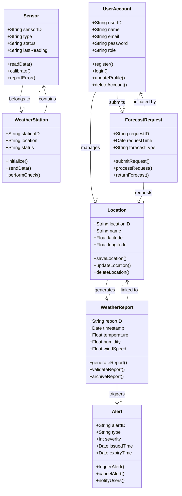

## 2. UML Class Diagram (Mermaid.js)

### 💡 Design Rationale
- **Encapsulation:** Attributes and methods are grouped logically per entity.
- **Relationships:** Arrows express multiplicity and direction (e.g., one station has many sensors).
- **Traceability:** Reflects entity relationships in the domain model and system behavior.

